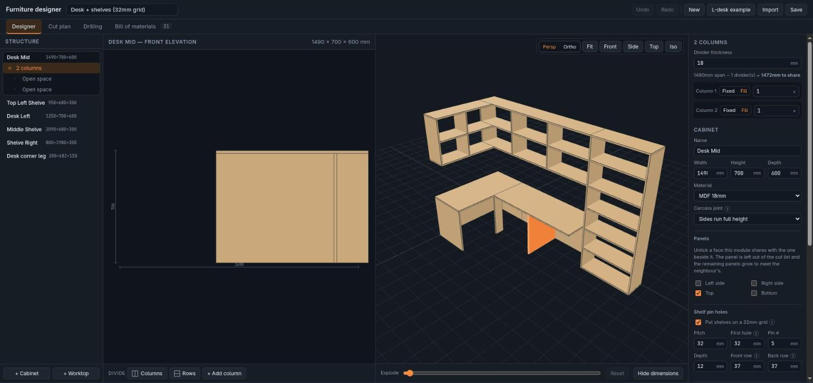

# Furniture Designer

Design a piece of furniture in the browser and get out everything you need to build it:
an exact cut list, a sheet nesting plan, and a drilling schedule with printable jigs.



## Running it

Needs Node 20 or newer.

```bash
npm install
npm run dev      # http://localhost:5173
```

That's it — no backend, no database, no config. Your work is saved in the browser as you
go; **Save** downloads the project as JSON and **Import** reads it back.

```bash
npm test         # 128 tests, no browser needed
npm run build    # static files in dist/
npm run preview  # serve the build
```

`dist/` is plain static files, so it deploys anywhere.

## The tabs

**Designer** — build the piece. Pick a cabinet, click a space in the 2D elevation, and
either divide it (columns or rows) or fill it with shelves, drawers or a door. Sizes are
exact millimetres in the inspector; the 3D view orbits, explodes, and selects any part
you click. Any face can take its own material — a solid timber top on an MDF carcass —
and each panel's real thickness flows through every measurement that depends on it.

**Cut plan** — the sheet layouts. Set your sheet size and saw kerf and it nests every
part, tells you how many sheets to buy, and says whether that count could actually be
lower. Prints, or exports CSV.

**Bill of materials** — every part with its cut size and quantity, plus hardware counts
and a cost estimate. Exports a **cutting order as .xlsx** in the column layout board
shops ask for, one worksheet per material, with the shop's own rules checked first:
minimum cuttable piece, minimum bandable piece, one banding format per piece, and
whether cut-size compensation should be off because the shop applies banding to the size
you give. Edit your materials and sheet prices here. Mark a material
**supplied to size** — a solid timber top, glass, anything bought rather than cut — and
its parts drop out of the cut plan and the sheet count but stay listed with their
dimensions, so you still know what to order.

**Drilling** — where to put every shelf-pin hole, in each panel's own coordinates, plus
parametric jigs to drill them accurately (OpenSCAD or FreeCAD macro).

Start with **L-desk example** in the header to see a finished design.

## How it works

One idea holds it together:

```
buildDesign(design) → Part[]
```

A design becomes a flat list of world-placed panels, and the 3D viewport, the bill of
materials and the nester are all just views of that list. Geometry is computed once, in
pure TypeScript with no React and no three.js, which is why those views can never
disagree — and why the tests can cover the part that matters without a browser.

```
src/
  core/     pure, tested: types, geometry, nesting, hole grid, jigs
  state/    zustand store, tree edits, undo/redo
  ui/       designer · cut plan · bill of materials · drilling
```

Everything under `src/core/` is framework-free. That is where the maths lives, and where
the tests point: exact panel sizes for every carcass and back style, no overlapping
placements, kerf respected, grain never rotated, and an end-to-end desk asserted panel
by panel.

## Licence

MIT
